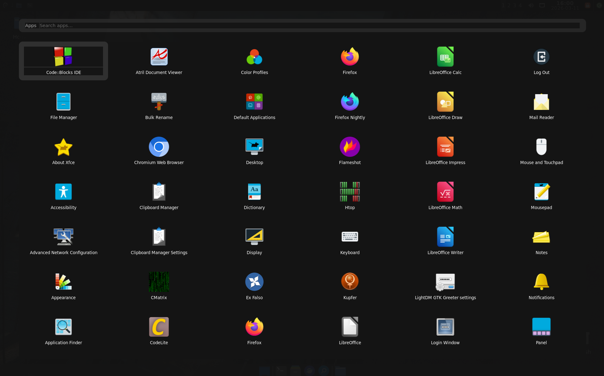
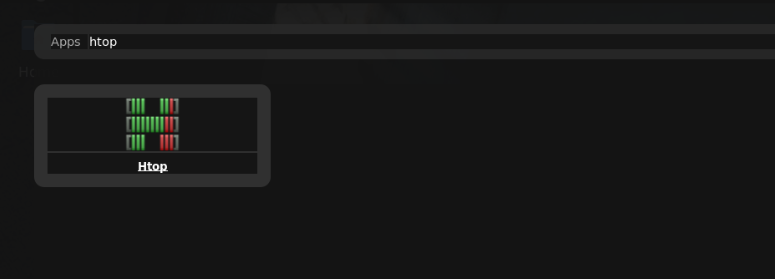

This is a custom full screen app menu using rofi for XFCE desktop
** tested on Debian 13 xfce **

Step 1 : Install rofi
cmd : sudo apt install rofi

Step 2 : create a folder "rofi" in .config

Step 3 : Download the file "config.rasi" and "grid.rasi" from this repo and paste it in ".config/rofi/"

Step 4 : Test it with below command 
cmd : rofi -show drun

Step 5 : Assign super key to the command
1 - In XFCE - open "Settings Manager" > "Keyboard" > "Application Shortcut" > "+Add" 
2 - Add cmd : rofi -show drun
3 - Set key to " Super / Windows key "

